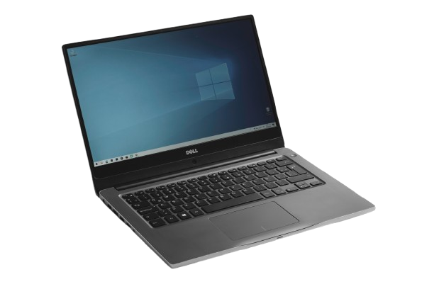
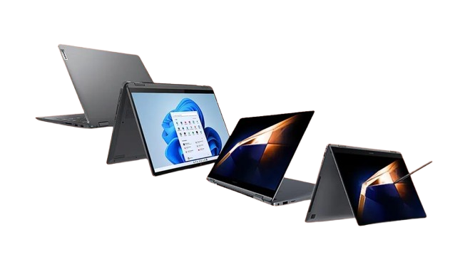

# Projeto-Notebooks-Escola-David-Paz
<h2>Projeto de Modernização Tecnológica: Aquisição de Notebooks para a Escola Estadual de Tecnologia e Inovação</h2>

<h3>1. Resumo Executivo</h3>
A Escola Estadual de Tecnologia e Inovação enfrenta sérios desafios com computadores obsoletos e limitantes para o ensino contemporâneo. Este projeto propõe a aquisição de 30 notebooks modernos para substituição integral dos desktops atuais, garantindo mobilidade, flexibilidade pedagógica e atualização tecnológica. Os principais benefícios incluem melhoria na qualidade do ensino, redução de custos operacionais em 30% e otimização do espaço físico, posicionando a instituição na vanguarda da educação tecnológica.

---

<h3>2. Introdução e Justificativa</h3>
O cenário tecnológico atual da nossa instituição é preocupante. Utilizamos computadores desktop com mais de oito anos de utilização, equipamentos com hardware defasado e desempenho insuficiente para aplicações educacionais modernas. Esta limitação técnica impacta diretamente a qualidade do ensino, impedindo a implementação de metodologias inovadoras e restringindo o acesso dos estudantes às ferramentas tecnológicas essenciais para sua formação.

A fixação dos equipamentos em laboratórios específicos constitui outra limitação significativa, impossibilitando a realização de aulas dinâmicas em diferentes espaços da escola e dificultando a integração transversal da tecnologia no currículo educacional. Esta rigidez operacional impede que professores desenvolvam atividades pedagógicas inovadoras que requeiram mobilidade e flexibilidade de ambientes.

A substituição por notebooks representa uma transformação paradigmática na forma de conceber e implementar o uso educacional da tecnologia. Permitirá a integração tecnológica em salas de aula comuns, possibilitando que qualquer espaço da escola transforme-se em ambiente de aprendizagem tecnológica. A mobilidade dos equipamentos facilitará a realização de atividades externas, projetos interdisciplinares e pesquisas de campo apoiadas por tecnologia.

Do ponto de vista operacional, os notebooks modernos consomem significativamente menos energia que os desktops antigos, promovendo sustentabilidade e economia financeira. A atualização do parque tecnológico com equipamentos de maior vida útil e menor necessidade de manutenção representa outro aspecto relevante, contribuindo para a otimização dos recursos institucionais.

---

<h3>3. Objetivos</h3>

- Modernizar integralmente a infraestrutura tecnológica da escola mediante substituição de 30 desktops obsoletos por notebooks modernos 

- Reduzir em 30% o consumo de energia em comparação com os desktops atualmente em uso  

- Aumentar em 40% a utilização dos equipamentos através do uso em diferentes espaços da escola  

- Implementar sistema completo de segurança com rastreamento e proteção para garantia do investimento 

- Capacitar professores e técnicos para aproveitamento máximo dos novos recursos tecnológicos 

---

<h3>4. Especificações Técnicas dos Notebooks</h3>

| Componente       | Especificação Mínima       | Especificação Recomendada |
|------------------|-----------------------------|----------------------------|
| **Processador**  | Intel Core i5-1135G7        | Intel Core i7-1165G7       |
| **Memória RAM**  | 8 GB DDR4                   | 16 GB DDR4                 |
| **Armazenamento**| SSD 256 GB                  | SSD 512 GB NVMe            |
| **Sistema**      | Windows 11 Pro              | Windows 11 Pro             |
| **Tela**         | 14" Full HD (1920x1080)     | 14" Full HD IPS (1920x1080)|
| **Bateria**      | 5h autonomia                | 8h autonomia               |
| **Peso**         | Até 2,0 kg                  | Até 1,5 kg                 |
| **Conectividade**| Wi-Fi 6, Bluetooth 5.0      | Wi-Fi 6E, Bluetooth 5.2    |
| **Portas**       | 2x USB-A, 1x USB-C, HDMI    | 2x Thunderbolt 4, HDMI, USB-A |
| **Garantia**     | 12 meses                    | 24 meses                   |

   
   

  
Figura 1: Modelo de notebook com especificações ideais para ambiente educacional

---

<h3>Referências Técnicas</h3>

- Especificações para Educação - Intel Education  

- Notebooks para Educação - Dell Technologies 
 

- Vantagens dos Notebooks em Ambiente Educacional - Microsoft Education 
 

---

<h3>5. Orçamento Estimado</h3>

| Item                          | Custo Unitário (R$) | Quantidade | Custo Total (R$) |
|--------------------------------|---------------------|------------|------------------|
| Notebook                       | 5.500,00           | 30         | 165.000,00       |
| Seguro contra acidentes (anual)| 200,00             | 30         | 6.000,00         |
| Sistema de rastreamento        | 150,00             | 30         | 4.500,00         |
| Licenças Software Educacional  | 300,00             | 30         | 9.000,00         |
| Bolsas/Cases de Proteção       | 100,00             | 30         | 3.000,00         |
| Roteador Wi-Fi 6               | 800,00             | 2          | 1.600,00         |
| Instalação e Configuração      | 1.500,00           | 1          | 1.500,00         |
| Capacitação de Professores     | 2.000,00           | 1          | 2.000,00         |
| **TOTAL GERAL**                |                     |            | **192.600,00**   |

---

<h3>6. Benefícios Esperados</h3>

<h4>Para os Alunos</h4>
A aquisição dos notebooks proporcionará aos estudantes acesso a tecnologia moderna e portátil, possibilitando o desenvolvimento de atividades pedagógicas inovadoras e a aquisição de competências digitais essenciais para sua formação integral. A mobilidade dos equipamentos permitirá realização de atividades em grupo colaborativas, pesquisas em tempo real em diferentes ambientes da escola e desenvolvimento de projetos interdisciplinares com suporte tecnológico imediato.

<h4>Para os Professores</h4>
O corpo docente terá flexibilidade para preparar e ministrar aulas em diferentes ambientes da escola, representando avanço considerável na prática pedagógica. O uso de recursos multimídia e ferramentas educacionais inovadoras será facilitado, potencializando a qualidade do ensino e permitindo maior diversificação de metodologias. O engajamento dos estudantes tende a aumentar significativamente com a utilização de tecnologia atual e atraente.

<h4>Para a Instituição</h4>
A escola beneficiar-se-á com expressiva redução de custos com energia elétrica (estimada em 30%), otimização do espaço físico através da eliminação de grandes mesas para CPUs e monitores, e valorização da imagem da instituição como centro tecnologicamente atualizado e comprometido com a qualidade educacional. A mobilidade dos equipamentos permitirá melhor aproveitamento dos espaços existentes e maior versatilidade no planejamento de atividades.

---

<h3>Vantagens Operacionais</h3>
A manutenção dos notebooks é significativamente mais simples e econômica que a dos desktops, com menor tempo de inatividade em caso de necessidade de reparos. A vida útil dos equipamentos é maior, e a atualização do parque tecnológico será mais gradual e menos onerosa futuramente.

---

<h3>7. Cronograma (Simplificado)</h3>

| Fase          | Duração   | Período                | Responsáveis       |
|---------------|-----------|------------------------|--------------------|
| Planejamento  | 2 semanas | 01/06/2025 - 15/06/2025| Equipe de TI       |
| Licitação     | 3 semanas | 16/06/2025 - 07/07/2025| Administração      |
| Aquisição     | 4 semanas | 08/07/2025 - 04/08/2025| Compras            |
| Instalação    | 2 semanas | 05/08/2025 - 18/08/2025| TI e Fornecedor    |
| Capacitação   | 1 semana  | 19/08/2025 - 25/08/2025| Pedagogia e TI     |
| Implantação   | 1 semana  | 26/08/2025 - 01/09/2025| Todos os envolvidos|

---

<h3>8. Considerações Finais</h3>
A aquisição dos notebooks aqui proposta configura-se como investimento estratégico de fundamental importância para o futuro da Escola Estadual de Tecnologia e Inovação. Esta iniciativa alinha-se perfeitamente com as demandas contemporâneas por mobilidade e integração tecnológica, posicionando a instituição na vanguarda da educação tecnológica. A substituição dos desktops obsoletos por notebooks modernos transcende a mera atualização equipamental; representa transformação profunda na forma de conceber e implementar o uso educativo da tecnologia.

Os benefícios pedagógicos esperados justificam amplamente o investimento proposto, com impactos positivos no processo de ensino-aprendizagem que perdurarão por anos. A modernização da infraestrutura tecnológica tornará o processo educacional mais dinâmico, integrado e alinhado com as exigências do mundo contemporâneo. Os notebooks demonstram-se como a solução ideal pelo equilíbrio entre performance, mobilidade, custo-benefício e durabilidadade, oferecendo flexibilidade necessária para os desafios educacionais do século XXI.

Recomenda-se veementemente a aprovação deste projeto para que nossa escola mantenha sua posição de referência em educação tecnológica e continue oferecendo ensino de qualidade compatível com as expectativas de nossa comunidade e com as demandas do mercado de trabalho atual.

